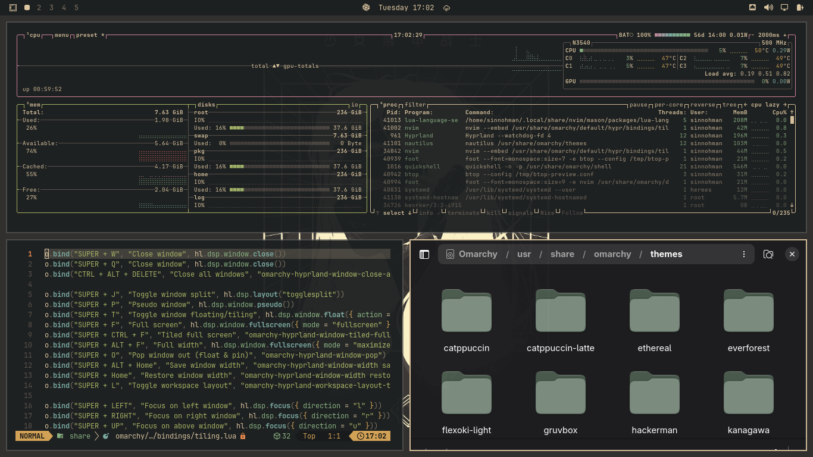
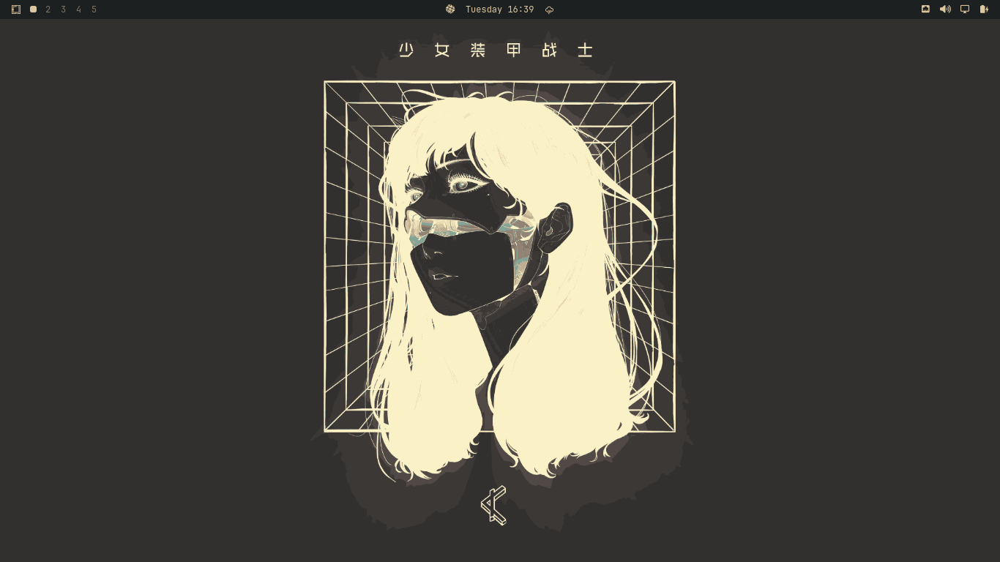

# Gruvbox Lady — an Omarchy theme



The bare desktop - wallpaper and bar only:



A dark **Gruvbox Material** theme for [Omarchy](https://omarchy.org) with a warm
cream accent, built from a real KDE Plasma desktop and its "lady" wallpaper.

## Install

```bash
omarchy-theme-install https://github.com/Sinnohman/omarchy-gruvbox-lady-theme
```

Or manually:

```bash
git clone https://github.com/Sinnohman/omarchy-gruvbox-lady-theme \
  ~/.config/omarchy/themes/gruvbox-lady
omarchy-theme-set gruvbox-lady
```

## What's in it

| File | Purpose |
|---|---|
| `colors.toml` | The palette. Omarchy generates the bar, borders, terminal, browser and editor themes from this |
| `backgrounds/1-lady.png` | The wallpaper |
| `icons.theme` | Names the `Yaru-sage` icon theme - muted grey-green folders, chosen over Omarchy's default `Yaru-olive` lime |
| `preview.png` | Screenshot of the theme running on Omarchy 4 |

### Palette

| Role | Value |
|---|---|
| Background | `#1d2021` |
| Foreground | `#ddc7a1` |
| **Accent** | **`#d4be98`** (warm cream — the character of this theme) |
| Selection | `#45403d` |
| Red / green / yellow | `#ea6962` / `#a9b665` / `#d8a657` |
| Blue / cyan / magenta / orange | `#7daea3` / `#89b482` / `#d3869b` / `#e78a4e` |

**How this differs from Omarchy's built-in `gruvbox`:** that theme uses a `#282828`
background and a **teal** `#7daea3` accent. This one is darker (`#1d2021`) and
warm-accented (`#d4be98`), matching the wallpaper.

## Credits

This theme is a remix, and the credit belongs to other people:

- **[Gruvbox](https://github.com/morhetz/gruvbox)** — the original color scheme by
  **Pavel Pertsev ([@morhetz](https://github.com/morhetz))**, MIT. Every palette in
  this family descends from it.
- **[Gruvbox Material](https://github.com/sainnhe/gruvbox-material)** — **the exact
  palette used here**, by **sainnhe ([@sainnhe](https://github.com/sainnhe))**, MIT.
  Gruvbox Material is itself "a modified version of Gruvbox" with softer contrast.
- **[Gruvbox Plus Icon Pack](https://github.com/SylEleuth/gruvbox-plus-icon-pack)** —
  by **[SylEleuth](https://github.com/SylEleuth)**, **GPL-3.0**. It is itself based on
  Suru++, OneDark, Papirus and Breeze Dark, and its own metadata credits
  **Andrea Bonanni** as the original author of the underlying icon work.
  This repository only *names* that icon theme — it does not redistribute it, so the
  GPL does not extend to this repo's files.
- **Gruvbox-Retro GTK theme** — the source desktop's GTK theme ("a flat GTK+ theme
  based on Elegant Design"). Its upstream author could not be identified; if that's
  you, open an issue and we'll add the credit.
- **Wallpaper — `backgrounds/1-lady.png`: attributed to Park JunKyu
  ([GHARLIERA](https://www.artstation.com/gharly))** — a Korean cyberpunk artist
  ([Instagram](https://www.instagram.com/gharliera/), [gharliera.com](https://gharliera.com/)).
  The artwork carries the Chinese title 少女装甲战士 ("Girl Armored Warrior"), which matches a
  collection crediting him, and the style is unmistakably his. The file itself shipped with no
  embedded attribution (only a GIMP sRGB profile), so this attribution is **not 100% confirmed**.
  The artwork remains (c) Park JunKyu and is included for personal desktop theming only — it is
  **not** covered by this repo's MIT grant. **If the attribution is wrong, or you are the artist
  and want it credited differently or removed, open an issue and we will fix it immediately.**
- **[Omarchy](https://omarchy.org)** ([basecamp/omarchy](https://github.com/basecamp/omarchy)) —
  the theme format, the generator and the templates that turn `colors.toml` into a
  full desktop theme are all Omarchy's work.

## License

The files authored here (`colors.toml`, `icons.theme`) are **MIT** — see
[LICENSE](LICENSE). The wallpaper is included at the author's request with the
provenance noted above and is **not** covered by that MIT grant.
